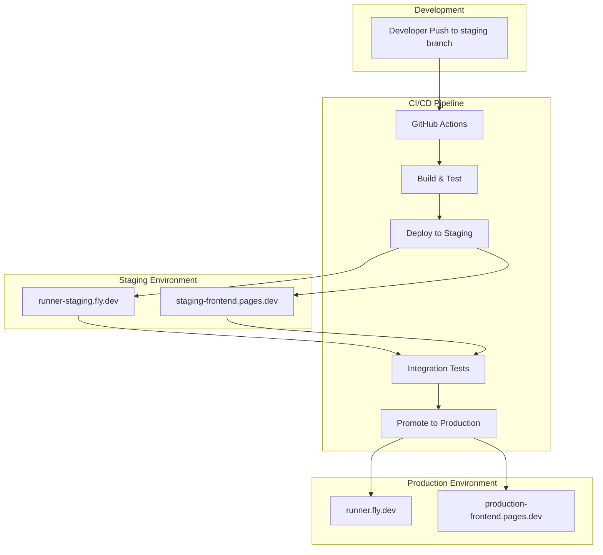

# Design Document

## Overview

This design establishes a comprehensive pre-production development test environment for the codecanvas project. The solution creates parallel staging infrastructure that mirrors production while providing safe testing capabilities. The design includes automated deployment pipelines, environment-specific configuration management, and promotion workflows that ensure code quality before production deployment.

## Architecture

### High-Level Architecture



### Environment Separation Strategy

1. **Branch-based Deployment**: 
   - `staging` branch triggers staging deployment
   - `main` branch triggers production deployment
   - Feature branches can optionally deploy to ephemeral environments

2. **Infrastructure Isolation**:
   - Separate Fly.io apps: `runner` (prod) and `runner-staging` (staging)
   - Separate frontend deployments with environment-specific configurations
   - Independent resource allocation and scaling

3. **Configuration Management**:
   - Environment-specific fly.toml files
   - Build-time environment variable injection for frontend
   - Shared Docker images with runtime configuration differences

## Components and Interfaces

### 1. Backend Staging Infrastructure

**Fly.io Staging App Configuration**
- App name: `runner-staging`
- URL: `runner-staging.fly.dev`
- Same Docker image as production with staging-specific environment variables
- Independent scaling and resource allocation

**Key Changes Required**:
- Create `fly.staging.toml` configuration file
- Add staging-specific environment variables
- Configure staging app in Fly.io dashboard

### 2. Frontend Environment Configuration

**Environment Configuration System**
- Replace hardcoded URLs in `config-utils.js` with build-time environment detection
- Support for multiple environments: `local`, `staging`, `production`
- Webpack configuration updates for environment-specific builds

**Configuration Structure**:
```javascript
const environments = {
  local: {
    url: "http://localhost:10100/api/v1/",
  },
  staging: {
    url: "https://runner-staging.fly.dev/api/v1/",
  },
  production: {
    url: "https://runner.fly.dev/api/v1/",
  }
};
```

### 3. CI/CD Pipeline Enhancements

**Staging Deployment Workflow**
- Trigger: Push to `staging` branch
- Steps: Build → Test → Deploy to staging → Integration tests
- Artifacts: Docker images tagged with staging identifiers

**Production Promotion Workflow**
- Trigger: Manual approval or automated after staging validation
- Steps: Promote same Docker image → Deploy to production → Smoke tests
- Rollback capability if deployment fails

### 4. Integration Testing Framework

**Automated Testing Suite**
- API endpoint validation against staging environment
- Frontend-backend integration tests
- Code execution functionality verification
- Performance baseline validation

**Test Categories**:
- Health checks (API availability, response times)
- Functional tests (code execution for supported languages)
- Security tests (input validation, resource limits)
- Load tests (concurrent request handling)

## Data Models

### Environment Configuration Model

```typescript
interface EnvironmentConfig {
  name: 'local' | 'staging' | 'production';
  apiUrl: string;
  deploymentTarget: string;
  resourceLimits: {
    numRunners: number;
    timeout: number;
  };
}
```

### Deployment Metadata Model

```typescript
interface DeploymentInfo {
  environment: string;
  version: string;
  commitSha: string;
  deployedAt: Date;
  deployedBy: string;
  status: 'pending' | 'deployed' | 'failed' | 'rolled-back';
}
```

## Error Handling

### Deployment Failure Recovery

1. **Staging Deployment Failures**:
   - Automatic rollback to previous staging version
   - Notification to development team via GitHub Actions
   - Detailed error logging and artifact preservation

2. **Production Promotion Failures**:
   - Immediate rollback to previous production version
   - Circuit breaker to prevent further deployments
   - Escalation to on-call team

3. **Integration Test Failures**:
   - Block promotion to production
   - Detailed test result reporting
   - Automatic retry mechanism for transient failures

### Environment Isolation Safeguards

1. **Resource Tagging**: All staging resources clearly labeled
2. **Access Controls**: Separate API tokens and permissions
3. **Data Isolation**: No shared state between environments
4. **Network Isolation**: Separate Fly.io apps with independent networking

## Testing Strategy

### 1. Automated Integration Testing

**API Testing Suite**:
- Language support validation
- Code execution accuracy testing
- Error handling verification
- Performance benchmarking

**Frontend Testing Suite**:
- Environment configuration validation
- API integration testing
- User workflow testing
- Cross-browser compatibility

### 2. Manual Testing Workflows

**Staging Validation Process**:
1. Automated deployment completion notification
2. Manual smoke testing checklist
3. Feature-specific testing based on changes
4. Performance and security validation

**Production Readiness Checklist**:
- All automated tests passing
- Manual testing completed
- Performance metrics within acceptable ranges
- Security scan results reviewed

### 3. Monitoring and Observability

**Staging Environment Monitoring**:
- Application health metrics
- Resource utilization tracking
- Error rate monitoring
- Performance baseline comparison

**Deployment Pipeline Monitoring**:
- Build and deployment duration tracking
- Success/failure rate metrics
- Test execution time monitoring
- Resource usage optimization

## Implementation Phases

### Phase 1: Infrastructure Setup
- Create staging Fly.io app
- Configure staging-specific fly.toml
- Set up staging secrets and environment variables

### Phase 2: CI/CD Pipeline Updates
- Create staging deployment workflow
- Update existing production workflow
- Implement promotion mechanism

### Phase 3: Frontend Configuration
- Implement environment-aware configuration
- Update build process for multiple environments
- Create staging frontend deployment

### Phase 4: Testing and Validation
- Implement integration test suite
- Set up monitoring and alerting
- Create documentation and runbooks

### Phase 5: Promotion Workflow
- Implement manual promotion process
- Add automated promotion triggers
- Create rollback procedures

## Security Considerations

1. **Secrets Management**: Separate secrets for staging and production environments
2. **Access Control**: Limited access to production promotion workflows
3. **Code Execution Safety**: Same security constraints as production for staging
4. **Network Security**: Proper firewall and access controls for staging infrastructure

## Performance Considerations

1. **Resource Allocation**: Staging environment sized appropriately for testing needs
2. **Cost Optimization**: Automatic scaling down during off-hours
3. **Build Optimization**: Shared Docker layers between staging and production
4. **Test Execution**: Parallel test execution to minimize pipeline duration