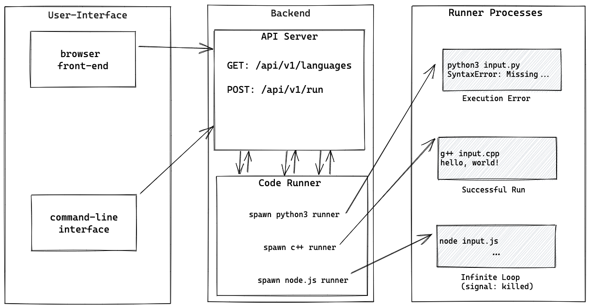

# design

Implementation details and notes for development.

## code engine

Components:

1. backend
    1. executor/engine: executes the user's code on the server, handles security, compiles, and return code output
    2. internal server api: exposes a full API for the executor's instructions, possibly not needed if we build this more like a monolith
    3. external api: the api that can be accessed externally where user provides (ideally) just the language and snippet of code to run
2. integrations (frontend):
    1. [PRIORITY] command line interface: CLIs make this somewhat easier to test end-2-end
    2. [PRIORITY] browser: would like to have a nice looking website to show this off!
    3. VSCode extension: let users write code and pass it off to our server to acually run it, this might be a stretch goal

We should decide on the API design first, quickly, then implement API functionality.
After API design is finished, smaller groups can mock API response and be able to plug in easily.

### Daemon API Design

Provides execute access into code runner container.

#### input

**option 1**

1. setup commands to run (copy user code in)
2. path to use as filesystem (prepared directory to use as "root")
3. command to execute (compile and/or run command e.g `g++ --std=c++11 main.cpp -o main` or `python3.9 main.py`)

**option 2**

1. file to copy in
2. commands to execute

#### output

1. stdout
2. stderr
3. exit code

### Server API Design

### Client API Design

### security

#### linux syscalls

- [prlimit](https://man7.org/linux/man-pages/man1/prlimit.1.html): get and set process limits
- [timeout](https://man7.org/linux/man-pages/man1/timeout.1.html): run a command with a time limit
- [pivot_root](https://man7.org/linux/man-pages/man8/pivot_root.8.html): change the root filesystem
- [chroot](https://man7.org/linux/man-pages/man2/chroot.2.html): change root directory (also see https://superuser.com/questions/1575316/usage-of-chroot-after-pivot-root)

## whiteboarding

