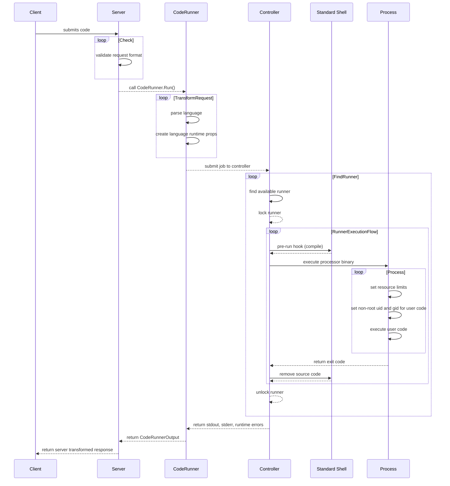

# 401X runner project

[](https://codecov.io/gh/camerondurham/runner)
[](https://github.com/camerondurham/runner/actions?query=workflow%3A%22Unit+Test%22)
[](https://github.com/camerondurham/runner/actions?query=workflow%3A%22Go+Lint%22)
[](https://img.shields.io/github/go-mod/go-version/camerondurham/runner)

## Intro

The runner project is to create an interface for users to run their code remotely without having
to have any compiler on their machine. This is a work in progress project for TCSS 401X :)

### High Level Architecture Diagram


### Project State

Sequence diagram with rough state of the project.

[Mermaid Live Editor](https://mermaid-js.github.io/mermaid-live-editor/edit#pako:eNqNVMty2zAM_BUMT8mM3Q_wIRc3ubYT96gLTcE2awpQQdBtJpN_L6lnrKZJpING5O4CWIJ4No5rNBsT8VdCcvjV26PYpqJt8Ei6vrvboVxQNhDTvvEaoRAqqigwt7A9oTtXBN3TI19RLjb42iqCFPWocGBprFaEVBeJgZAZ2yz6mIgKy9kQYF74kj83t1PEH2IpFp3HXnMMPhMWcq2ViBAsHZM94odwJ1gyHvEgidQ3CK1wG6fMX9E7PqlwCLNN8JP3oJzNGnemAh481T21z2UmL5QOGQj2Yn2w-9Al8hZnQQrszhO0vAXexe1j3v9Bl9QzPQT-PZqxSGKnlmorNexOGEJ2UHCdJeHEfIYbx03rA97O5Gv8MqP_BPku7DDGDWCXUWdwWWCBvScrT2PyUwEDY14tz7D4WjCi5oaLnMTlc_SlaT_FIaa1MCskn33P3h_zN3capIgytP0HMmMtbzCGxlmSF2YJahLKOrmFrvnvnpBgwxeEoeZr4mdOp0vu_cZKdNVaQzn9u2TNt2moJ2rNSVfliyKr6VLlH5b474UaB8hAnze_JW2TXk2Obk7NkboN0HFKYF16oWWK2RKzMg3mCeTrPPGeS8WV0RM2WJnshMkunStT0UvGpbYMrvvaK4vZHGyIuDI2Ke-eyJmNSsIRNIzMAfXyFw9h2JY)



### Repository Structure

These components live in the following paths:

- browser front-end: does not exist _yet_
- command-line interface: [`cli/runner/`](https://github.com/camerondurham/runner/tree/main/cli/runner)
- API Server: [`api/`](https://github.com/camerondurham/runner/tree/main/api)
- CodeRunner: [`engine/coderunner`](https://github.com/camerondurham/runner/tree/main/engine/coderunner)
- Runner Containers: [`engine/runtime`](https://github.com/camerondurham/runner/tree/main/engine/runtime)

## Dev Environment

Editors:

- [Visual Studio Code](https://code.visualstudio.com/Download)
- [GoLand](https://www.jetbrains.com/go/) from Jetbrains for free with an [educational license](https://www.jetbrains.com/community/education/#students)

Extensions setup docs:

- Writing Go in VSCode: <https://code.visualstudio.com/docs/languages/go>
- Debugging Go in VSCode: <https://github.com/golang/vscode-go/blob/master/docs/debugging.md>

Recommended extensions (VSCode):

Search for these extension ids in VSCode and feel free to
add your personal favs:

1. `golang.go`
   for running and debugging Go (see [vscode-go debugging docs](https://github.com/golang/vscode-go/blob/master/docs/debugging.md))
1. `eamodio.gitlens`
   git lens (pro tip, enable editor heat map in upper right corner)
1. `ms-vscode-remote.remote-containers`
   develop in containers with all dependencies pre-installed
1. `ms-vscode-remote.remote-wsl`
   for Windows WSL users
1. `yzhang.markdown-all-in-one`
   for writing docs

Docker:

We will likely end up using Docker and include instructions here. For now, you
can install [Docker Desktop](https://www.docker.com/get-started) if you like.

### Using Dev Containers with VSCode (recommended)

To use a pre-built development container, you can use the VSCode and the dev container provided in `.devcontainer/devcontainer.json`.
This approach will use a Docker container with Go, cobra, python3, and g++ pre-installed and ready to use.

Here is a waay to long video with ~5 mins showing setup and total 12 mins
demoing using the container: [runner devcontainer setup video](https://youtu.be/f9qBHyzxIlo)

Steps:

1. Verify that you have [Docker](https://www.docker.com/get-started) running
1. Open VSCode and install the **Remote - Containers** extension: `ms-vscode-remote.remote-containers`
1. Run the dev container
   1. Open the Command Palette (cmd + shift + P on macOS, `F1` or ctrl + shift + p on Windows/Linux)
   1. Run `Remote-Containers: Open Folder in Container`
   1. Select the `runner` repository folder
1. Wait for the dev container to start up and open the VSCode Terminal as needed to run commands!

Also see [Remote-Containers: open an existing folder in a container](https://code.visualstudio.com/docs/remote/containers#_quick-start-open-an-existing-folder-in-a-container).


## Development

This repository is primarily written in Go and the Makefile has a helper
commands to make development easier and more consistent.

> Note: before you start development, please run `make install-hooks`
> to install [Git Hooks](https://git-scm.com/book/en/v2/Customizing-Git-Git-Hooks)
> in your repository's `.git/hooks` directory. This will install a pre-commit
> hook that automatically formats your code with [gofmt](https://go.dev/blog/gofmt).

### Using the Earthfile

[Earthly](https://earthly.dev/) is a Go CLI that works with Docker. It is build tool that lets you run continuous
integration and deployment actions locally. The reason it is being used here is to make CI/CD for this repo easier.

For this repo in particular, we need some tests to run in a Dockerized Linux environment to
be as close to our deployment image as possible. Earthly makes this really easy since it can
can run tests as part of its build process.

- [Earthly Website](https://earthly.dev/)
- [Learn the basics](https://docs.earthly.dev/basics)

#### Installing

For macOS users:
```shell
brew install earthly/earthly/earthly && earthly bootstrap
```

For other users: [earthly.dev/get-earthly](https://earthly.dev/get-earthly)

#### Using

To use, just check the target you want to run in the `Earthfile`. It is effectively like a
Makefile + Dockerfile and below are a few commands you may want to run during development.

```shell
# run all tests and lints, just like how they'll be run in CI when you open a PR
earthly +run-ci

# lint the sourcecode with the golangci lint tool
earthly +lint

# just test the go code with coverage
earthly +test-go
```

### Using the Makefile

By now, you are probably familiar with Makefiles. If not, this
wiki provides a great summary: [cs104/wiki/makefile](https://bytes.usc.edu/cs104/wiki/makefile/) (written by Leif Wesche).

Here's a quick summary of what the targets will do:

```bash
# print out all the makefile targets
make

# create or create mocks for unit testing, helpful if you have
# modified any of the interfaces in a `types.go` file
make gen-mocks

# run the API server (blocking, you can't use the terminal anymore)
make run-api

# run all tests in the repository
make test

# run go fmt on the repository to format your code
make fmt

# install git-hooks to automatically format your code before you commit
make install-hooks
```

### CLI Setup

CLI stands for command line interface.

> Note: this step is **not** needed if you are using the [dev container](#dev-container-recommended) since `cobra` is pre-installed in the container.

#### Installing the `cobra` CLI to help with codegen

Install cobra dependencies: (required to generate new CLI commands)

```bash
go install github.com/spf13/cobra/cobra@v1.3.0
```

#### Adding New Commands

Add new cobra command

```bash
# change directories into the CLI sourcecode
cd cli/runner

# add new subcommand
cobra add <CHILD_COMMAND> -p <PARENT_COMMAND>

# example:
cobra add childCommand -p 'parentCommand'
```

#### Other Resources

- Where the CLI code lives in this repo: [cli/runner](https://github.com/camerondurham/runner/tree/main/cli/runner)
- [Docs: Cobra Concepts](https://cobra.dev/#concepts)
- [Docs: Getting Started](https://cobra.dev/#getting-started)
- Examples:
  - [adding a command line flag to CLI](https://github.com/camerondurham/ch/blob/4bb750335485169e469bdb191c8ca29bb107b358/cmd/create.go#L171)
  - [reading what user set flag to](https://github.com/camerondurham/ch/blob/4bb750335485169e469bdb191c8ca29bb107b358/cmd/create.go#L75)

### Running the Server

During CLI or even server development, you will likely want to run the server during testing.

In the root directory `runner`, you can run the API a couple ways:

```bash
# 1. use the Makefile
make run-api

# 2. just use the go command
go run api/main.go
```

Usually you'll want to run the server in the background to you can do other
things with your terminal. However, you'd need to kill the process running on port `10100`
once you're done. You can use the `api/kill_server.sh` script for this.

```bash
# 1. run the API in the background
go run api/main.go &

# 2. once you are done, use the script to shut down processes on port 10100
./api/kill_server.sh

```

You can also use the `api/kill_server.sh` script if you see this error:

> error starting server: listen tcp :10100: bind: address already in use

### Go Tips

#### Working with Go Modules

Go Module:

```bash
# you usually will not have to run this since we should already have a go.mod and go.sum file
go mod init github.com/<name>/<repo-name>

# add new library
go get <new dependency>

# organize modules and dependencies
go mod tidy

# remove dependency
go mod edit -dropreplace github.com/go-chi/chi
```

## Testing

### Unit Tests

**What are unit tests and why do we use them?**

Unit testing is used to help us make sure smaller "units" of the code
work as expected and handle all expected error cases. This project will end up being pretty
large and we want to use unit tests to verify individual components before
piecing everything together.

In [runner_test.go](https://github.com/camerondurham/runner/blob/b594c4e023009d06109eb206c2f3e288dddd5e4c/engine/coderunner/runner_test.go#L25-L38),
we mock the response of the runtime to isolate what we are testing and produce
consist results without actually calling our "real code" in the `runtime`
module.

More about unit tests: [Definition of a Unit Test](https://www.artofunittesting.com/definition-of-a-unit-test).

**How to generate mocks:**

Install the Go CLI `mockgen` to create mocks from [Go interfaces](https://gobyexample.com/interfaces):

```bash
go install github.com/golang/mock/mockgen@v1.6.0
```

Using Mockgen to create new mocks for testing:

Basic command structure:

```bash
mockgen -source ./path/to/file/with/filename.go -destinaion ./path/to/write/mocks/filename.go InterfaceName
```

Example:

In `engine/runtime/types.go` there is the interface `Runtime` that we would like to mock for unit tests:

```go
type Runtime interface {
  RunCmd(runprops *RunProps) (*RunOutput, error)
}
```

The command below will create a mock-able `Runtime` interface, helper functions to implement
`Runtime` that you can call `RunCmd` on.

We can organize mocks in a submodule by making the `engine/runtime/mocks` directory and provide that and a filename to write the mocked classes.

```bash
mockgen -source ./engine/runtime/types.go -package=mocks -destination ./engine/runtime/mocks/Runtime.go Runtime
```

You can see an example [here](https://github.com/camerondurham/runner/blob/b594c4e023009d06109eb206c2f3e288dddd5e4c/engine/coderunner/runner_test.go#L25-L38)
of how to actually use mocks in a unit test.

> Note: The command above has been added to the `Makefile`. If you are creating mocks
> you want for a new file or interface, feel free to add those commands to the
> `gen-mocks` target so these are generated when you run `make gen-mocks`.

## Integration Testing

Will add more about this later! Here's some [reading](https://martinfowler.com/bliki/IntegrationTest.html) from Martin Fowler for now!

There aren't examples of integration testing in the repo yet.

## Documentation

When writing instructions for users and in the README, please follow syntax recommended by [google developer docs](https://developers.google.com/style/code-syntax)

## Other things

### Change package name (just in case)

```bash
# change module name in all files
 find . -type f \( -name '*.go' -o -name '*.mod' \) -exec sed -i -e "s;runner-x;runner;g" {} +
```
